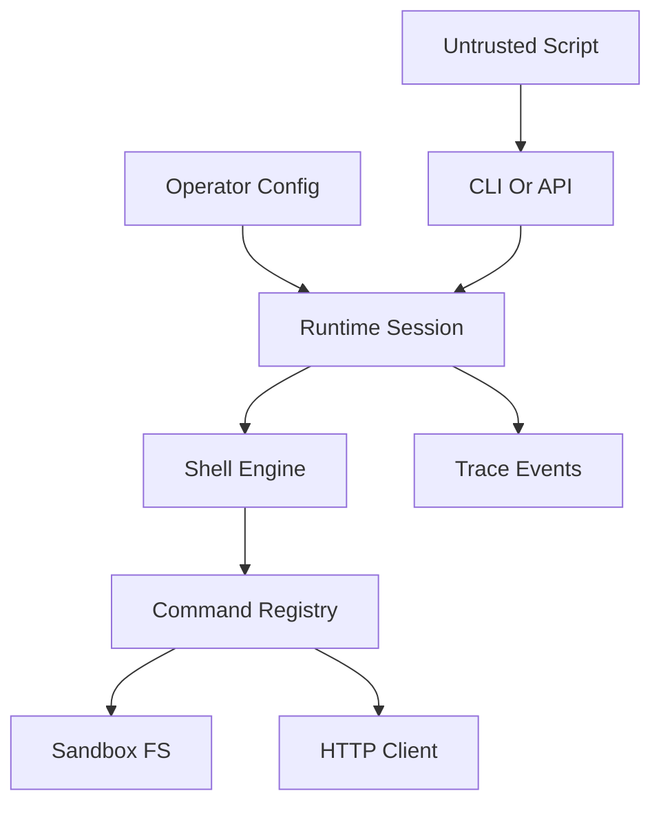

## Executive summary
`gbash` is a deterministic shell runtime intended to execute untrusted or semi-trusted shell text inside a sandbox, but its effective security boundary depends heavily on embedder configuration. The strongest risk themes are boundary misconfiguration around filesystem and network access, availability exhaustion from large-input and nested-execution paths, a concrete symlink-policy gap in `OverlayFS`, and trace leakage of sensitive command arguments. Evidence anchors: `runtime/runtime.go` / `New`, `runtime/session.go` / `Session.exec`, `shell/mvdan.go` / `Run` and `execHandler`, `fs/overlay.go` / `Realpath`, `commands/io_helpers.go` / `readAllFile`, `network/network.go` / `HTTPClient.Do`, `trace/trace.go` / `CommandEvent`.

## Scope and assumptions
- In scope: `cmd/gbash/`, `runtime/`, `shell/`, `commands/`, `fs/`, `policy/`, `network/`, `trace/`, `SPEC.md`, `README.md`.
- Out of scope: tests, fuzz fixtures, and local development tooling except where they provide evidence about intended runtime behavior.
- Confirmed context: untrusted scripts are expected; a session is intended to be single-tenant; network egress and non-memory filesystem backends may be enabled by operator/user configuration.
- Assumption: the repository is primarily a library/runtime plus a local CLI, not a standalone network service with built-in authentication or tenancy controls. Evidence anchors: `cmd/gbash/cli.go` / `runCLI`, `runtime/runtime.go` / `Runtime`, `README.md`.
- Assumption: the default posture is virtual filesystem, no host subprocess fallback, network off unless a client is injected, and symlink traversal denied. Evidence anchors: `runtime/runtime.go` / `New`, `policy/policy.go` / `SymlinkDeny`, `shell/mvdan.go` / `execHandler`.
- Open questions that would materially change ranking:
  - Which concrete lower filesystem backends will be used in production beyond `MemoryFS` and whether any expose host-mounted secrets or shared workspaces.
  - Whether `ExecutionResult.Events` will be persisted outside the tenant boundary or sent to centralized logging/telemetry systems.
  - How restrictive production network allowlists will be and whether `DenyPrivateRanges` will be enabled on all deployments.

## System model
### Primary components
- CLI front end: `cmd/gbash/cli.go` reads script text from stdin or launches the interactive shell in `cmd/gbash/repl.go`, then delegates execution to the runtime.
- Runtime/session layer: `runtime/runtime.go` / `Runtime.New`, `Runtime.NewSession`, and `runtime/session.go` / `Session.exec` build the session filesystem, registry, policy, environment, output buffers, and trace recorder.
- Shell engine: `shell/mvdan.go` / `MVdan.Run` parses and executes shell ASTs using `mvdan/sh` with project-owned handlers for file access, command resolution, and nested execution.
- Command registry and implementations: `commands/registry.go` / `DefaultRegistry` defines the executable surface area; commands run as Go code, not host subprocesses. Unknown commands fail with `127` in `shell/mvdan.go` / `execHandler`.
- Filesystem abstraction: `fs/fs.go` defines the interface; `fs/memory.go` provides the default in-memory filesystem; `fs/overlay.go` provides a lower-plus-upper overlay backend.
- Policy layer: `policy/policy.go` / `Static.AllowPath`, `AllowCommand`, and `policy/pathcheck.go` / `CheckPath` enforce root restrictions and symlink behavior.
- Optional network client: `network/network.go` / `HTTPClient.Do` implements allowlisted HTTP egress and is exposed only when the runtime is configured with a network client, which also registers `curl` in `runtime/runtime.go` / `New` and `commands/curl.go` / `Run`.
- Trace output: `trace/trace.go` defines event payloads returned in `ExecutionResult.Events`; `runtime/session.go` wires a trace buffer into each execution.

### Data flows and trust boundaries
- Operator/embedder config -> Runtime factory
  - Data crossing: filesystem factory, policy roots, allowed commands, base env, optional network client/config.
  - Channel/protocol: in-process Go API.
  - Security guarantees: none intrinsic; this is a trusted administrative boundary.
  - Validation/normalization: nil-defaulting and config normalization in `runtime/runtime.go` / `New` and `network/network.go` / `resolveConfig`.
  - Evidence anchors: `runtime/runtime.go` / `Config` and `New`, `network/network.go` / `New`.
- Untrusted script input -> Shell engine
  - Data crossing: shell text, stdin, args, env overrides, workdir, timeout.
  - Channel/protocol: CLI stdin or Go API (`ExecutionRequest`).
  - Security guarantees: shell parsing, budget validation, loop instrumentation, output truncation; no authn/authz layer is built into the repo.
  - Validation/normalization: parse with `mvdan/sh`, `validateExecutionBudgets`, `instrumentLoopBudgets`, working-directory resolution.
  - Evidence anchors: `cmd/gbash/cli.go` / `runScript`, `cmd/gbash/repl.go` / `runInteractiveShell`, `runtime/session.go` / `Session.exec`, `shell/validation.go`, `shell/instrument.go`.
- Shell engine -> Command registry
  - Data crossing: resolved command name/path and argv.
  - Channel/protocol: in-process dispatch via `interp.ExecHandler`.
  - Security guarantees: registry-backed command allowlist, builtin checks, unknown commands return `127`, no host fallback.
  - Validation/normalization: lookup through virtual `PATH`, command allowlist checks in policy.
  - Evidence anchors: `shell/mvdan.go` / `lookupCommand`, `execHandler`, `commands/registry.go` / `DefaultRegistry`.
- Commands -> Sandboxed filesystem
  - Data crossing: file paths, directory traversals, reads, writes, renames, symlink operations, file contents.
  - Channel/protocol: `fs.FileSystem` interface.
  - Security guarantees: path root checks and default symlink denial, but enforcement quality depends on backend `Realpath` behavior.
  - Validation/normalization: `policy.CheckPath`, `gbfs.Resolve`, backend `Realpath`.
  - Evidence anchors: `policy/pathcheck.go` / `CheckPath`, `policy/policy.go` / `Static.AllowPath`, `shell/mvdan.go` / `openHandler`, `readDirHandler`, `statHandler`, `commands/command.go` / `allowPath`.
- Commands -> Optional network
  - Data crossing: URL, method, headers, body, redirects, response body.
  - Channel/protocol: HTTP(S).
  - Security guarantees: URL-prefix allowlist, method allowlist, redirect revalidation, response-size cap, optional private-range blocking.
  - Validation/normalization: URL parsing, normalized allowlist entries, DNS/private-range checks when enabled.
  - Evidence anchors: `commands/curl.go` / `Run`, `network/network.go` / `HTTPClient.Do`, `checkURLAllowed`, `checkPrivateHost`.
- Runtime -> Trace consumer
  - Data crossing: command argv, working directory, file paths, policy denials, timings, exit codes.
  - Channel/protocol: returned `ExecutionResult.Events`.
  - Security guarantees: none intrinsic beyond in-memory buffering for a single execution.
  - Validation/normalization: event struct assembly only; no redaction layer is present.
  - Evidence anchors: `runtime/session.go` / `Session.exec`, `trace/trace.go` / `Event` and `CommandEvent`, `shell/mvdan.go` / `recordCommand`.

#### Diagram

## Assets and security objectives
| Asset | Why it matters | Security objective (C/I/A) |
| --- | --- | --- |
| Session workspace files and generated artifacts | Contains prompts, source code, tool outputs, and any staged secrets or tokens visible to the shell. | C/I |
| Embedder-provided lower filesystem or mounted files | A non-memory backend can expose host-adjacent files, persistent secrets, or state outside the intended workspace. | C/I |
| Policy and runtime configuration | Read/write roots, allowed commands, and network configuration define the real blast radius of untrusted scripts. | I |
| Network reachability to allowlisted destinations | If enabled, the runtime can contact external or internal services and move data across trust boundaries. | C/I |
| Runtime availability | Agents may depend on this runtime inside shared workers; memory or CPU exhaustion can deny service to adjacent workloads. | A |
| Execution traces and logs | Traces can contain secret-bearing argv, URLs, and sensitive file paths useful for exfiltration or later replay. | C |

## Attacker model
### Capabilities
- Provide arbitrary shell text through stdin, REPL input, or `ExecutionRequest.Script`. Evidence anchors: `cmd/gbash/cli.go` / `runScript`, `cmd/gbash/repl.go` / `runInteractiveShell`, `runtime/session.go` / `Session.exec`.
- Control command arguments, pathnames, stdin, and per-execution environment/workdir overrides. Evidence anchors: `commands/command.go` / `Invocation`, `runtime/runtime.go` / `ExecutionRequest`.
- Use nested shell execution through `bash`, `sh`, `env`, `timeout`, and `xargs`, still inside the same session. Evidence anchors: `commands/bash.go`, `commands/env.go`, `commands/timeout.go`, `commands/xargs.go`, `commands/subexec_helpers.go`.
- If network is enabled, fully control `curl` request URL, method, headers, body, and redirect-follow behavior within the configured network client envelope. Evidence anchors: `commands/curl.go` / `Run`, `network/network.go` / `Request` and `HTTPClient.Do`.

### Non-capabilities
- Cannot cause unknown commands to fall through to the host OS; unresolved commands return `127`. Evidence anchors: `shell/mvdan.go` / `execHandler`, `commands/registry.go` / `DefaultRegistry`.
- Cannot use contrib `awk` as a subprocess/file I/O escape hatch because `goawk` is configured with `NoExec`, `NoFileWrites`, and `NoFileReads`. Evidence anchor: `contrib/awk/awk.go` / `Run`.
- Cannot use network egress unless the embedder injects a network client; `curl` fails closed if `inv.Net` is nil. Evidence anchors: `runtime/runtime.go` / `New`, `commands/curl.go` / `Run`.
- Is not assumed to share a session with another tenant based on provided context, so cross-tenant persistence through session reuse is out of scope for this report.

## Entry points and attack surfaces
| Surface | How reached | Trust boundary | Notes | Evidence (repo path / symbol) |
| --- | --- | --- | --- | --- |
| Script stdin | `go run ./cmd/gbash < script.sh` or API caller passes `ExecutionRequest.Script` | Untrusted script -> runtime | Primary arbitrary-code input for batch execution. | `cmd/gbash/cli.go` / `runScript`; `runtime/runtime.go` / `ExecutionRequest` |
| Interactive REPL input | TTY stdin or `-i` flag | Untrusted script -> long-lived session | Persists filesystem and shell-visible env across entries. | `cmd/gbash/repl.go` / `runInteractiveShell`, `nextInteractiveState` |
| Nested subexec wrappers | `bash`, `sh`, `env`, `timeout`, `xargs` | Untrusted command -> nested execution engine | Amplifies work factor while staying inside same sandbox session. | `commands/bash.go`; `commands/env.go`; `commands/timeout.go`; `commands/xargs.go` |
| Filesystem operations | Redirections, built-in commands, command lookup | Runtime -> FS backend | The highest-value boundary for confidentiality and integrity. | `shell/mvdan.go` / `openHandler`, `lookupCommandPath`; `commands/command.go` / `allowPath` |
| HTTP egress | `curl` when network configured | Runtime -> external/internal HTTP services | Entirely config-dependent; includes potential SSRF and exfil paths. | `commands/curl.go` / `Run`; `network/network.go` / `HTTPClient.Do` |
| Trace/event return path | `ExecutionResult.Events` returned to caller | Runtime -> orchestrator/log sink | Sensitive if argv or file paths contain credentials or secrets. | `runtime/session.go` / `Session.exec`; `trace/trace.go` / `CommandEvent` |

## Top abuse paths
1. Attacker submits shell text that walks the configured workspace or lower filesystem with `find`, `rg`, `cat`, or `jq`, locates secrets, and prints or stages them for later exfiltration. Impact: confidentiality loss of workspace or mounted data.
2. Operator enables network egress with a broad allowlist; attacker uses `curl` to send workspace contents or command output to an external collector, or to probe internal HTTP endpoints if private-range blocking is off. Impact: exfiltration or SSRF.
3. Embedder uses `OverlayFS` with a lower layer containing a symlink that points outside the intended read root; attacker reads the symlink path, `policy.CheckPath` trusts `OverlayFS.Realpath`, and the lower backend follows the symlink. Impact: read access outside intended path policy.
4. Attacker feeds very large stdin or files into commands that call `io.ReadAll`, or fans out nested execution via `xargs`, `bash -c`, and shell loops until memory, CPU, or timeout budgets are exhausted. Impact: worker or session denial of service.
5. Attacker places bearer tokens, URLs with query secrets, or sensitive filenames directly in command-line arguments such as `curl -H`, causing those values to be stored in trace events returned to the embedder or centralized logs. Impact: secondary secret disclosure.
6. Attacker uses allowed write operations to overwrite or poison files inside configured write roots, influencing later agent steps or corrupting artifacts within the same tenant. Impact: integrity loss inside the allowed workspace.

## Threat model table
| Threat ID | Threat source | Prerequisites | Threat action | Impact | Impacted assets | Existing controls (evidence) | Gaps | Recommended mitigations | Detection ideas | Likelihood | Impact severity | Priority |
| --- | --- | --- | --- | --- | --- | --- | --- | --- | --- | --- | --- | --- |
| TM-001 | Untrusted user or LLM-authored script | A deployment uses a non-memory backend or broad read/write roots that expose sensitive files beyond the intended ephemeral workspace. Sessions are single-tenant, but the same tenant may still hold valuable secrets. | Enumerate and read files with allowed commands, then overwrite or stage data inside allowed roots. | Confidentiality and integrity compromise of workspace files, mounted secrets, or persistent lower-layer content. | Session workspace, lower filesystem content, runtime config integrity | Registry-backed commands only and no host fallback reduce direct host RCE. Path checks exist in `policy/pathcheck.go` / `CheckPath` and are invoked from `shell/mvdan.go` / `openHandler` and `commands/command.go` / `allowPath`. Default backend is `MemoryFS` in `runtime/runtime.go` / `New`. | Default roots are `"/"` inside the chosen FS in `runtime/runtime.go` / `New`, so the repo does not create a strong workspace boundary by itself. There is no built-in classification of sensitive prefixes or separate tenant/workspace policy profile. | Ship a safe default profile that constrains read/write roots to a per-session workspace subtree. Add explicit "workspace root" helpers to `runtime.Config` and document non-memory backend risks. Consider deny-by-default prefixes for secret mounts. | Alert on `trace.EventFileAccess` and `trace.EventFileMutation` under sensitive prefixes, and on unusually broad directory walks (`find`, `rg`, `tree`) in a fresh session. | Medium: untrusted scripts are expected and filesystem scope is operator-defined, so this becomes realistic in misconfigured deployments. | High: exposed files may include source, prompts, tokens, or persistent artifacts. | high |
| TM-002 | Untrusted script with optional network enabled | Operator injects `NetworkClient` and registers `curl`; allowlists are broad enough to permit exfiltration or internal probing, or private-range blocking is disabled. | Use `curl` to send data out, harvest internal HTTP resources, or follow allowed redirects to sensitive destinations. | External data exfiltration, SSRF-like access to internal services, and integrity impact on reachable APIs. | Workspace data, internal service data, network trust | `curl` is unavailable unless network is configured in `runtime/runtime.go` / `New`, and `commands/curl.go` / `Run` fails closed without `inv.Net`. `network/network.go` / `HTTPClient.Do` enforces URL-prefix allowlists, method allowlists, redirect revalidation, optional private-range blocking, and response caps. | Practical network gating depends on injected client/config, not on a policy decision point during command execution. Inference from repo search: `policy.NetworkMode` is stored in `policy.Static` but no enforcement call site was found beyond config plumbing, so operators may overestimate policy coverage. | Require explicit per-deployment egress profiles with narrow host and path prefixes, enable `DenyPrivateRanges` by default, and add a runtime-level "network disabled" guard that is enforced even if a client is present. Consider separate upload/download scopes and header allowlists for `curl`. | Log and alert on `curl` usage, destination host/path, redirects, and large response bodies. Flag access to internal hostnames or unusual POST destinations. | Medium: network is optional, but the user confirmed it is expected in some deployments and the request surface is fully attacker-controlled once enabled. | High: reachable endpoints can expose secrets or trigger external side effects. | high |
| TM-003 | Untrusted script against overlay-backed storage | The deployment uses `fs.OverlayFS` or another backend whose `Realpath` does not resolve symlinks, and the lower layer contains a symlink crossing an intended root boundary. | Read a symlink path that passes raw root checks while the lower backend follows the link to a denied target. | Confidentiality breach outside intended read roots and possible policy bypass for future write-like paths depending on backend behavior. | Lower filesystem content, policy integrity | The intended control is `policy.CheckPath` resolving targets and denying traversal when `SymlinkMode` is `deny`. Default policy sets `SymlinkDeny` in `runtime/runtime.go` / `New`, and `MemoryFS.Realpath` does resolve symlinks in `fs/memory.go` / `Realpath`. Runtime tests cover symlink denial for `MemoryFS` in `runtime/symlink_policy_test.go`. | `fs/overlay.go` / `Realpath` only verifies visibility and returns the input path instead of resolving symlinks, while `policy/pathcheck.go` / `CheckPath` depends on `Realpath` for symlink and resolved-root enforcement. No overlay-specific symlink regression coverage was found. | Fix `OverlayFS.Realpath` to resolve through upper/lower symlinks and re-check the resolved target. Add regression tests covering `OverlayFS` with `SymlinkDeny` and constrained roots. Until fixed, avoid `OverlayFS` for untrusted workloads or reject lower-layer symlinks at mount time. | Emit high-severity alerts when reading symlink-typed entries from overlay-backed stores, and add debug logging comparing raw and resolved paths during policy checks. | Medium: this requires overlay-backed deployments, but `OverlayFS` ships in the repo and is a plausible production backend. | High: a concrete policy-bypass can expose files outside intended roots. | high |
| TM-004 | Untrusted script focused on denial of service | Attacker can supply large stdin, large files within allowed roots, or repeated nested execution. | Trigger `io.ReadAll` paths and command amplification to exhaust memory, CPU, or wall-clock budgets. | Service degradation or worker/session failure. | Runtime availability, shared worker capacity | Command-count, loop, substitution-depth, glob, stdout, and stderr limits are set in `runtime/runtime.go` / `New`, enforced in `shell/validation.go`, `shell/instrument.go`, and `runtime/buffer.go`. Network responses are capped in `network/network.go` / `readResponse`. | `MaxFileBytes` is defined in `policy/policy.go` and defaulted in `runtime/runtime.go`, but no non-test enforcement was found. Multiple code paths use `io.ReadAll`, including `commands/io_helpers.go` / `readAllFile`, `commands/io_helpers.go` / `readAllStdin`, and `commands/bash.go` / `Run`. There is no aggregate memory quota for a session. | Enforce `MaxFileBytes` on file reads and writes, add bounded readers for stdin and command helpers, and consider aggregate per-execution memory ceilings. Add command-fanout controls for nested execution helpers and rate-limit repeated subexecs. | Track large file reads, repeated subexecs, truncated stdout/stderr, timeouts, and OOM-like failures. Alert on sessions that repeatedly hit command-count or timeout ceilings. | High: untrusted scripts are expected and the relevant code paths are easy to reach. | Medium: primary effect is availability, but in shared workers the blast radius can be broader. | high |
| TM-005 | Untrusted script with trace visibility outside the immediate tenant | The embedder stores or forwards `ExecutionResult.Events`, and secrets appear in command arguments, URLs, or file paths. | Place credentials in argv or URLs, then rely on trace collection to copy them into logs or downstream systems. | Secondary secret disclosure and incident-response blind spots if logs become toxic. | Trace data, credentials, workspace metadata | Trace events are structured and in-memory per execution via `trace.NewBuffer` and `runtime/session.go` / `Session.exec`. The runtime does not appear to capture the full environment by default, which slightly reduces scope. | `trace/trace.go` / `CommandEvent` stores `Argv`, `Dir`, and resolved paths; `shell/mvdan.go` / `recordCommand` records them without redaction. `curl` command lines commonly carry headers or URLs containing secrets. | Add trace redaction hooks for headers, tokens, and secret-like argv patterns before events leave the runtime. Prefer structured request fields over raw argv capture for high-risk commands like `curl`. Document trace sensitivity and default to opt-in external export. | Detect secret-like material in argv before persistence, and alert on commands containing `Authorization`, `Bearer`, signed URLs, or private-key-like strings. | Medium: this depends on how traces are consumed, but command-line secret placement is common in agent workflows. | Medium: exposure is often to internal systems, but it can widen to broader logging infrastructure. | medium |

## Criticality calibration
- Critical
  - Untrusted script gains read access to host-mounted or other highly sensitive data outside the intended workspace because a backend/root policy exposes it broadly.
  - Network-enabled deployment allows exfiltration of secrets to arbitrary or attacker-controlled destinations from within the runtime.
  - A concrete policy-bypass bug lets untrusted scripts cross intended root boundaries in production storage backends.
- High
  - Internal-service access or targeted exfiltration is possible to configured but over-broad allowlisted destinations.
  - Overlay-backed deployments can bypass symlink/root policy and expose sensitive lower-layer content.
  - Large-input or fanout attacks can reliably crash or starve shared workers handling agent tasks.
- Medium
  - Trace events can leak secrets or sensitive paths into internal logs or orchestration systems.
  - Integrity attacks can poison files inside the current tenant workspace without escaping it.
  - Network response shaping or redirect abuse can cause noisy but contained failures under a restrictive allowlist.
- Low
  - Same-tenant disclosure of low-sensitivity path metadata through error messages or traces.
  - Output truncation that hides some attacker activity but does not materially expand access.
  - Misuse requiring unlikely operator choices and no meaningful sensitive data in scope.

## Focus paths for security review
| Path | Why it matters | Related Threat IDs |
| --- | --- | --- |
| `runtime/runtime.go` | Establishes default filesystem roots, command surface, network registration, and security defaults. | TM-001, TM-002, TM-004 |
| `runtime/session.go` | Binds the live session filesystem, policy, network client, and trace buffer into each execution. | TM-001, TM-002, TM-004, TM-005 |
| `shell/mvdan.go` | Central chokepoint for command lookup, file access mediation, builtin handling, and trace recording. | TM-001, TM-003, TM-005 |
| `policy/pathcheck.go` | Decides whether symlink traversal and resolved-path root checks actually work. | TM-001, TM-003 |
| `policy/policy.go` | Defines root allowlists, symlink mode, and limit fields including the apparently unused `MaxFileBytes` and stored `NetworkMode`. | TM-001, TM-002, TM-004 |
| `fs/overlay.go` | Contains the concrete `Realpath` behavior that appears inconsistent with symlink-policy expectations. | TM-003 |
| `fs/memory.go` | Reference backend for correct symlink resolution and default single-session storage behavior. | TM-003 |
| `commands/io_helpers.go` | Contains unbounded `io.ReadAll` paths for file and stdin ingestion. | TM-004 |
| `commands/bash.go` | Nested shell execution path that amplifies attacker-controlled work while staying in-process. | TM-004 |
| `commands/xargs.go` | Command fanout helper that can multiply nested execution cost. | TM-004 |
| `commands/curl.go` | User-controlled network egress surface and likely source of trace-sensitive command arguments. | TM-002, TM-005 |
| `network/network.go` | Actual HTTP policy enforcement, including allowlists, redirects, private-range checks, and response caps. | TM-002, TM-004 |
| `trace/trace.go` | Defines what sensitive execution metadata is retained and returned to callers. | TM-005 |
